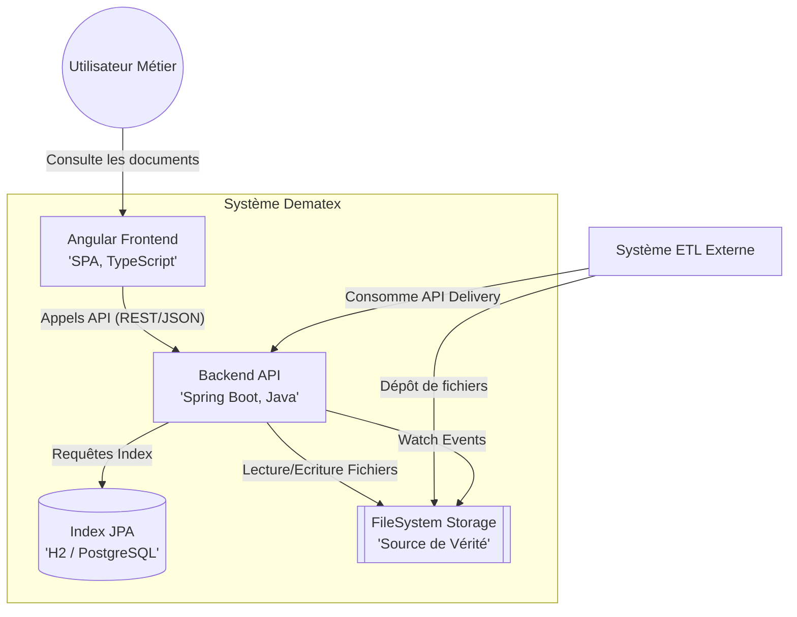
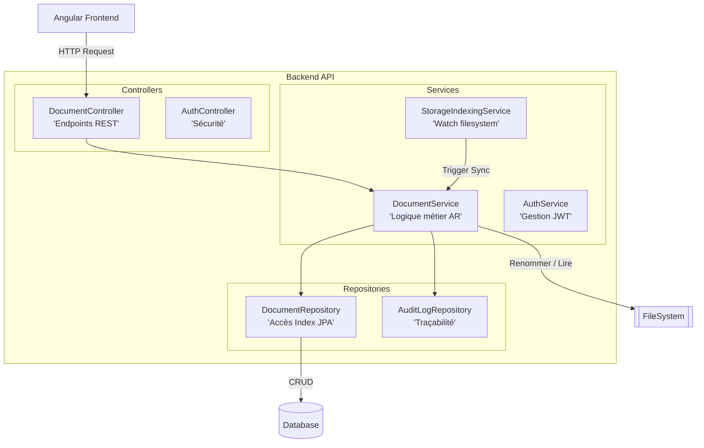
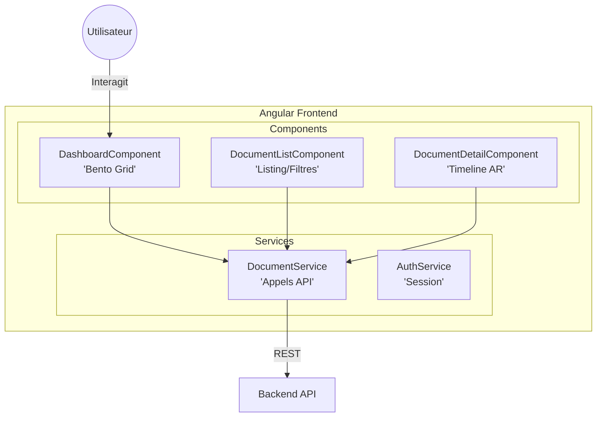

# Modèles C4 - Projet Dematex

Ce document présente l'architecture du Guichet Unique de Dématérialisation (Dematex) selon la méthodologie C4.

## 1. Niveau 2 : Diagramme de Conteneurs

Le diagramme de conteneurs montre la structure de haut niveau de l'application logicielle.

## 2. Niveau 3 : Diagramme de Composants (Backend)

Ce diagramme détaille les composants internes du conteneur **Backend API**.

## 3. Niveau 3 : Diagramme de Composants (Frontend)

Ce diagramme détaille les composants internes du conteneur **Angular Frontend**.

